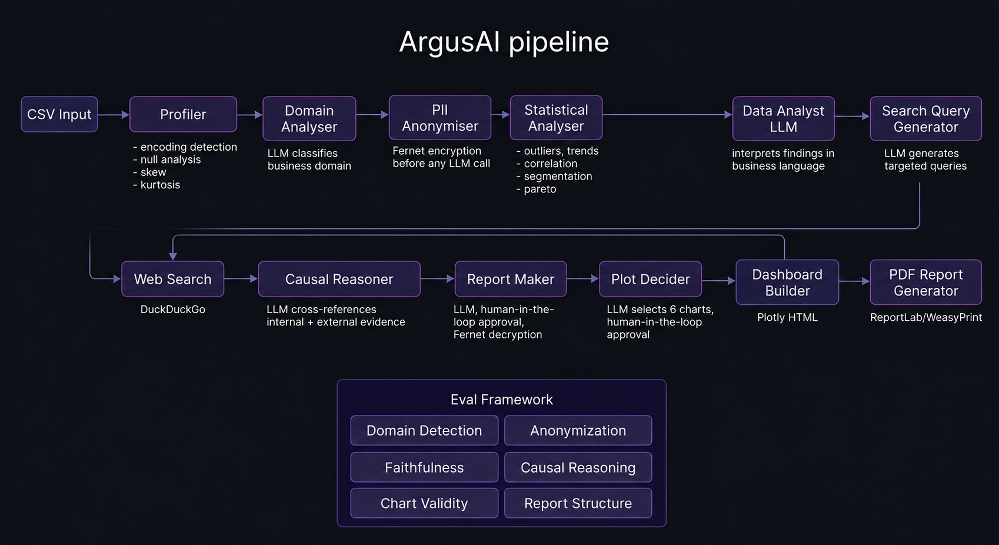

# ArgusAI — Agentic Business Intelligence Pipeline

ArgusAI is an agentic BI pipeline that turns a raw business CSV into a decrypted, human-reviewed executive report and an interactive dashboard — the kind of analysis a business analyst would normally take days to produce, generated end-to-end in minutes with privacy built in from the first step.

It's built as an 11-node LangGraph pipeline with real PII encryption, human-in-the-loop approval gates, dual-LLM fallback, and an LLM-cross-referenced causal reasoning stage — not just a single prompt wrapped in a UI.

🚀 **Live Demo:** [huggingface.co/spaces/chay123-crypto/ArgusAI](https://huggingface.co/spaces/chay123-crypto/ArgusAI)



---

## Table of Contents

- [Why This Matters (Business Intelligence POV)](#why-this-matters-business-intelligence-pov)
- [What It Does](#what-it-does)
- [Architecture](#architecture)
- [Pipeline Stages in Detail](#pipeline-stages-in-detail)
- [Stack](#stack)
- [Observability](#observability)
- [Deployment](#deployment)
- [Limitations](#limitations)
- [Run Locally](#run-locally)
- [Project Structure](#project-structure)

---

## Why This Matters (Business Intelligence POV)

Most "chat with your CSV" tools stop at summarization. ArgusAI is designed to mimic the actual workflow of a BI analyst:

- **Domain awareness** — it doesn't just describe numbers, it classifies the business context first (retail, HR, finance, manufacturing, logistics, etc.) and figures out which metrics matter and which direction "better" means for each one
- **Root-cause investigation, not just description** — beyond flagging an anomaly, it generates targeted web searches and runs a structured causal reasoning process to explain *why* something is happening, with explicit confidence levels and falsifiability checks rather than confidently making things up
- **Executive-ready output** — the deliverable is a report and dashboard meant for a decision-maker, not a data scientist: plain-language findings, an executive summary, and concrete recommended actions
- **Privacy-by-design** — PII never reaches an LLM in raw form, which matters the moment a tool like this touches real business data (customer names, employee records, transaction details) rather than toy datasets
- **A human stays in the loop** — the report and the dashboard both require explicit sign-off before being finalized, with a revise-and-regenerate loop, instead of blindly trusting LLM output to go straight to a stakeholder

The goal is to compress *profile data → find issues → research why → write the report → build the dashboard* — work normally split across a data analyst and a separate BI tool — into a single pipeline a non-technical user can run by uploading a file.

---

## What It Does

Upload any business CSV. ArgusAI autonomously:

1. **Profiles** the dataset — encoding detection, null rates, skew, kurtosis, dtype inference, likely ID/date/categorical/numeric columns
2. **Classifies the business domain** (retail, HR, manufacturing, finance, logistics, etc.) via LLM, with a structured confidence score
3. **Identifies and anonymizes PII columns with Fernet encryption** — before any row of data is sent to an LLM
4. **Runs 8 statistical analyses** — outliers (z-score), trend detection (linear regression), correlation, segmentation, percentage growth, distribution skew, Pareto/concentration analysis, and category performer ranking
5. **Interprets the statistical findings** in business language via an LLM data-analyst pass
6. **Generates targeted web search queries** to find real-world root causes for the issues found
7. **Searches the web** (Tavily) and extracts relevant findings
8. **Performs causal reasoning** — cross-references internal statistical evidence against external research through a structured 4-gate framework (fact → mechanism → variance → falsifiability), with automatic confidence caps for known data quality risks
9. **Drafts an executive report** → **pauses for human approval** (approve or send back with feedback for revision)
10. **Selects appropriate chart types** for the data → **pauses for human approval** (approve or revise)
11. **Builds an interactive Plotly dashboard**, decrypts anonymized identifiers back to real values, and renders a final PDF report

A chatbot follow-up node lets you ask questions about the completed analysis afterward, using the full pipeline output as context.

---

## Architecture

An 11-node LangGraph state machine with two conditional human-in-the-loop interrupts (`interrupt_before`). Execution pauses at `check_report` and `check_dashboard` until the user approves or requests a revision — approved runs resume from the exact checkpoint via `MemorySaver`, revisions loop back to regenerate just that stage.

```
CSV → Profiler → Domain Analyser → PII Anonymiser → Statistical Analyser
    → Data Analyst (LLM) → Search Query Gen → Web Search (Tavily) → Causal Reasoner
    → Report Maker → [human approval loop] → Plot Decider → [human approval loop]
    → Dashboard Builder → PDF Report Generator (decrypts PII for final output)
```

If revision is requested at either approval gate, the graph routes back to regenerate that specific stage with the user's feedback incorporated — it doesn't restart the whole pipeline.

**LLM routing:** Cerebras (`gpt-oss-120b`) is the primary model with automatic fallback to Groq (`Llama-4-Scout-17B`) via LangChain's `.with_fallbacks()`. A rate limit or outage on one provider doesn't kill the run. All LLM-calling functions are wrapped in a custom retry decorator (3 attempts, exponential backoff) on top of the model-level fallback.

---

## Pipeline Stages in Detail

**Profiling (`tools.py`)** — Tries multiple encodings (utf-8, latin-1, iso-8859-1, cp1252) until one works, then infers column types heuristically: high-cardinality strings as IDs, parseable date strings, numeric-coercible strings, and low-cardinality strings as categoricals. Computes skew/kurtosis per numeric column and fills missing values using mean (low skew) or median (high skew) accordingly.

**Domain classification (`tools.py`)** — A constrained-schema LLM prompt returns one of nine predefined business domains (or `other` with a free-text subdomain), a confidence level, the key metrics to track, and whether each metric is "higher is better" or "lower is better" — this direction label is used downstream by the statistical performer-ranking function.

**PII detection & anonymization (`tools.py`, `crypto.py`)** — An LLM identifies PII columns from column names alone (explicitly excludes machine IDs, sensor data, and SKUs from being flagged). Every unique value in a flagged column is encrypted with Fernet (symmetric, authenticated encryption) and replaced with a short `ID-xxxxxx` display token. The original Fernet ciphertext is kept in a mapping log so the final report/dashboard can decrypt back to real values — the LLM itself never sees real names, emails, or IDs at any stage.

**Statistical analysis (`stats.py`)** — Real, deterministic statistics, not LLM guesses: z-score outlier detection, `scipy.stats.linregress` for trend slope and R², pairwise correlation with a strong/moderate threshold and a "may be duplicate column" warning above 0.95, period-over-period percentage growth, distribution skew classification, and Pareto/concentration analysis on categorical segments.

**Causal reasoning (`tools.py`)** — The most heavily engineered prompt in the system. For every flagged issue, the LLM must complete four gates before claiming causality: state the exact metric (no vague language), describe the causal mechanism as Factor → Process → Effect, decompose variance into primary/secondary/unexplained contributors (only with numeric percentages if a source backs them — otherwise explicitly marked unknown), and provide one falsifying and one confirming data point. Confidence is automatically capped (e.g. to MEDIUM) when geographic concentration, missing data, or unverified outliers are present.

**Human-in-the-loop (`app.py`, `agent.py`)** — Implemented as `asyncio.Event`-gated pauses in the FastAPI job runner, synced with LangGraph's `interrupt_before`. The frontend polls `/status/{job_id}`, and the user's approve/reject decision is posted to `/approve_report/{job_id}` or `/approve_dashboard/{job_id}`, which sets the event and lets the backend resume the graph from its checkpoint.

**Dashboard & report generation (`visuals.py`, `report.py`)** — Charts are LLM-selected based on column types and statistical findings, then validated in code (`validate_charts`) to reject duplicate x/y pairs or invalid chart-type/data combinations before rendering. The dashboard is rendered as a themed, self-contained Plotly HTML file (random palette + Bootstrap theme per run). The final report is converted from Markdown to PDF via `pdfkit`/`wkhtmltopdf`.

---

## Stack

**Backend:** FastAPI · LangGraph · LangChain · Cerebras · Groq · Tavily · Plotly · pdfkit (wkhtmltopdf) · `cryptography` (Fernet) · LangSmith · pandas/numpy/scipy

**Frontend:** Vanilla JS · Tailwind CSS · HTML — served as static files directly from FastAPI, no separate frontend server or build step

**Job handling:** In-memory async job dictionary with `asyncio.Event`-based pause/resume for the two human-approval gates, exposed via polling (`/status/{job_id}`) and Server-Sent Events (`/stream/{job_id}`)

---

## Observability

LangSmith tracing is wired in via `@traceable` decorators on every LLM-calling function (`domain_analyser`, `anonymiser`, `data_analyst`, `search_queries`, `web_search`, `causal_reasoning`, `deciding_plots`, etc.), plus global tracing config in `config.py`. Every LLM call, retry, and fallback across all 11 nodes is logged to a LangSmith project — useful for debugging prompt behavior across a graph this size, where a silent failure in one node would otherwise be hard to trace back to its cause.

---

## Deployment

- **Hosting:** Hugging Face Spaces, Docker SDK, served on port 7860
- **Uptime:** A GitHub Actions workflow pings the Space every 5 minutes (`workflow_dispatch` + `schedule` cron) to prevent the free-tier instance from sleeping
- **Secrets:** `CEREBRAS_API_KEY`, `GROQ_API_KEY`, `LANGCHAIN_API_KEY`, and `TAVILY_API_KEY` are injected via HF Spaces repository secrets at runtime — never committed to the repo
- **System dependency:** `wkhtmltopdf` is installed in the Docker image (via the official `.deb` release, since it's unavailable through `apt` on Debian trixie/bullseye directly) to support PDF rendering

---

## Limitations

- **CSV only** — no Excel, JSON, or database connectors yet
- **Single flat table** — no multi-table or relational joins
- **Ephemeral storage** — uploaded files and generated reports don't persist across Space restarts (free-tier constraint); built for single-session use, not long-term storage
- **In-memory job state** — job tracking lives in a Python dict in the FastAPI process; restarting the server loses in-flight jobs, and this doesn't scale past a single worker
- **English-only** — domain detection and report generation assume English column names and content
- **LLM throughput** — large CSVs with many statistical findings can approach Cerebras/Groq free-tier rate limits; the retry + fallback logic absorbs most of this, but very large files may still be slow
- **Domain list is fixed** — the LLM classifies into one of nine predefined domains (or a free-text "other" subdomain); it doesn't learn new domain categories over time

---

## Run Locally

```bash
git clone https://github.com/chay123-crypto/ArgusAI.git
cd ArgusAI
pip install -r requirements.txt
```

Set environment variables (or use a `.env` file):
```
CEREBRAS_API_KEY=your_key
GROQ_API_KEY=your_key
LANGCHAIN_API_KEY=your_key
TAVILY_API_KEY=your_key
```

`wkhtmltopdf` must be installed and on your system `PATH` for PDF report generation (see the `Dockerfile` for the Linux install method).

Run:
```bash
uvicorn app:app --reload
```

Then open `http://localhost:7860`.

---

## Project Structure

```
.
├── app.py            # FastAPI app, job orchestration, HITL pause/resume endpoints
├── workflow.py        # LangGraph graph definition — nodes, edges, conditional routing
├── agent.py           # Node functions — one per pipeline stage, wraps tools/stats/visuals/report
├── state.py           # TypedDict schema for the shared LangGraph state
├── tools.py            # Profiling, domain classification, PII detection, web search, causal reasoning
├── stats.py           # Deterministic statistical analysis functions (outliers, trends, correlation, etc.)
├── crypto.py           # Fernet-based PII anonymization and decryption
├── visuals.py          # Chart selection (LLM), chart validation, Plotly dashboard rendering
├── report.py           # Markdown report generation, PDF conversion via pdfkit
├── evaluation.py       # 6-dimension eval framework for pipeline output quality
├── chatbot.py          # Post-analysis follow-up chatbot using pipeline output as context
├── helper.py            # Shared utilities — retry decorator, JSON-safe parsing, formatting helpers
├── llm.py              # LLM client setup — Cerebras primary, Groq fallback, SQLite response cache
├── config.py            # Model names, API key loading, retry config, dashboard color palettes
├── templates/           # Frontend — index.html, Tailwind/JS, sample CSV
└── architecture/        # Pipeline diagram
```
